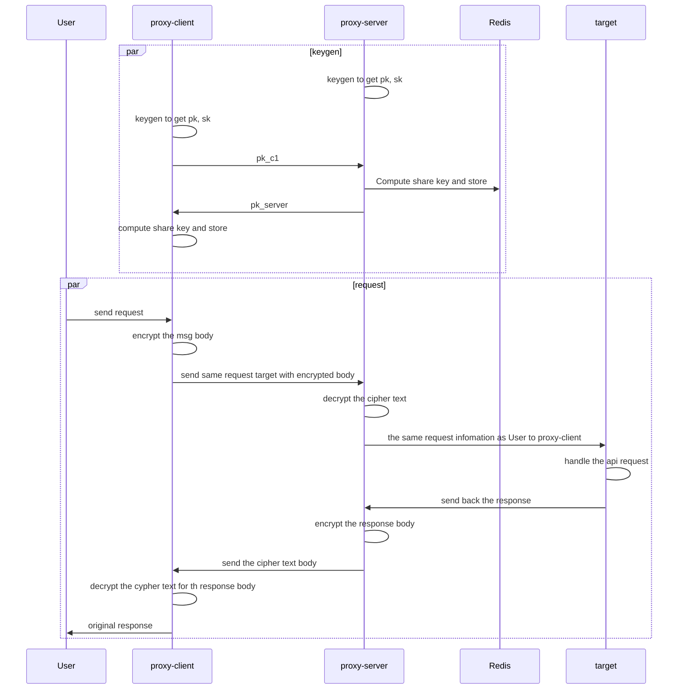

# Reverse Proxy Encryption

## Start the server

### pre-requirement
- docker
- docker-compose
  
### commands
```sh
docker-compose up -d --build    # build the docker image and start the nodes
docker ps                       # check running containers
docker logs ${id} -f            # show the streaming logs of container ${id}
docker-compose down             # close and delete the nodes
```

## Target

middleware for client side and server side proxy endpoint

protocal step:
1. define the proxy target for both client side and server side, where `proxy client` should redirect to `proxy server`, and `proxy server` redirect to `tartget api server`.
   
2. `proxy server` generate own $pk_{server}$, $sk_{server}$ <br>
   `proxy client` $C_1$ generate own $pk_{c1}$, $sk_{c1}$<br>
   both `proxy server` and `client` using same public generater and prime number in this protocol

3. User who is in client side want to send request to `target server`, will request to `client proxy` with same request body.

4. after `proxy client` side receive the request, it'll check if it have encryption key with `proxy server`, if yes then goto **7.**

5. `proxy client` send key gen request to `proxy server` with it's public key $pk_{c1}$, then `proxy server` will compute their DiffieHellmon key and store in `redis` with `proxy client`'s host ip as key. Last, `proxy server` send it's public key $pk_{server}$ as response.

6. `proxy client` receive the $pk_{server}$ then compute theie DiffieHellmon key, and store the key as variable in memory.

7. `proxy client` then encrypt the request body from user's request with the shared key, modify the request's header body size then send to `proxy server`

8. after `proxy server` receive the ciphertext, it's decrypt with the `proxy client`'s host ip key in `redis`, if there are no such key in `redis`, then would response to `proxy client` that it should restart form **5.**

9. `proxy server` decrypt the ciphertext and set the plantext back to request body. last, `proxy server` pass the request to the `target server` with decryption content.

10. response body from `target server` would also be encrypted by `proxy server`, using the shared key, and pass back to `proxy client`

11. then `proxy client` would decrypt the response body and replace with cipher body, then pass back to user.



## Additional feature: multiple server

if multiple server for handling high throughput event, we should set every server as same pk, sk key

> set the $sk_{server}$ to `redis` if not exist, then compute the $pk_{server}$

## Nodes

proxy-client: encrypt the request and decrypt the response

proxy-server: deal with encryption and the key gen algorithm

target server: return `{"msg": "ok"}` in 200 for every request showing the request is good

redis: read the key quickly and can share the shared key and the server secret key with all the other distribution servers

docker: easy deploying and system version controlling

redis-commander: GUI commander for checking the keys is stored correctly or not
